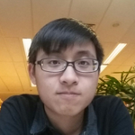
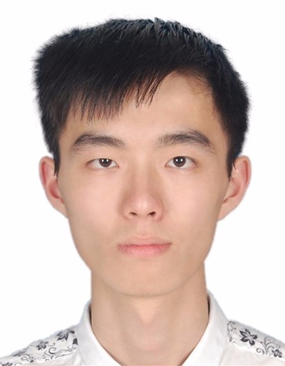
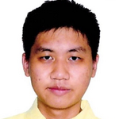

# About Us

We are a team of students based in the [School of Computing, National University of Singapore](http://www.comp.nus.edu.sg).

## Project Team

#### [Dhruv Jain](http://github.com/microcerebus)  
 
**Role**: Team Lead, Documentation, Deliverables 

* Components in charge of: [Model](https://github.com/CS2103AUG2016-T09-C1/main/blob/master/docs/DeveloperGuide.md#model-component)
* Aspects/tools in charge of: Testing, Git
* Features implemented:
   * [List persons](https://github.com/se-edu/addressbook-level4/blob/master/docs/UserGuide.md#listing-all-persons--list)
   * [Delete person](https://github.com/se-edu/addressbook-level4/blob/master/docs/UserGuide.md#deleting-a-person--delete)
* Code written: [[functional code](A123456.md)][[test code](A123456.md)][[docs](A123456.md)]
* Other major contributions:
  * Did the initial refactoring from AddressBook to ToDoList [[#133](https://github.com/se-edu/addressbook-level4/pull/152) ]
  * Set up Travis and Coveralls

-----

#### [Ashley Ong](http://github.com/ashleyyy94)
 

* Components in charge of: [Logic](https://github.com/CS2103AUG2016-T09-C1/main/blob/master/docs/DeveloperGuide.md#Logic)
* Aspects/tools in charge of: Testing, Integration, Git
* Features implemented:
   * [Add and delete tags](https://github.com/CS2103AUG2016-T09-C1/main/blob/master/docs/UserGuide.md#tag)
   * [Undo Command](https://github.com/CS2103AUG2016-T09-C1/main/blob/master/docs/UserGuide.md#undo)
* Code written: [[functional code](A0139481Y.md)][[test code](A0139481Y.md)][[docs](A0139481Y.md)]
* Other major contributions:
  * Did the initial refactoring from AddressBook to Inbx_0 [[commit 0a9d924](https://github.com/CS2103AUG2016-T09-C1/main/commit/0a9d924c8ce0162c35c05172d8efa222b2039f06) ]
  * Set up Travis and Coveralls
  * Tried to follow coding standards using Codacy

-----

#### [Chen Sidai](http://github.com/sidai) 
 
**Role**: Code Quality  

* Components in charge of: [UI](https://github.com/CS2103AUG2016-T09-C1/main/blob/master/docs/DeveloperGuide.md#ui-component)
* Features implemented:
   * [Find Command](https://github.com/CS2103AUG2016-T09-C1/main/blob/master/docs/UserGuide.md#4-finding-specific-tasks-find)
   * [Sort Command](https://github.com/CS2103AUG2016-T09-C1/main/blob/master/docs/UserGuide.md#5-sort-the-tasks-by-specific-sorting-criteria-sort)
* Code written: [[functional code](A0148044J.md)][[test code](A0148044J.md)][[docs](A0148044J.md)]
* Other major contributions:
  * Did the UI which included the sidepanel for filtering tasks into categories, the info panel and the popup for reminder

-----

#### [Zachary Foo](http://github.com/StylishGoldPen)
 
**Role**: Testing, Integration    

* Components in charge of: [Storage](https://github.com/CS2103AUG2016-T09-C1/main/blob/master/docs/DeveloperGuide.md#storage-component)
* Features implemented:
   * [Add Command] (https://github.com/CS2103AUG2016-T09-C1/main/blob/master/docs/UserGuide.md#2-adding-a-task-add)
   * [List by date, List overdue, List due date](https://github.com/CS2103AUG2016-T09-C1/main/blob/master/docs/UserGuide.md#3-listing-tasks-list)
   * [Edit Command](https://github.com/CS2103AUG2016-T09-C1/main/blob/master/docs/UserGuide.md#6-editing-a-task-edit)
   * [Done Command](https://github.com/CS2103AUG2016-T09-C1/main/blob/master/docs/UserGuide.md#12-marking-a-task-as-completed-done)
   * [Overdue Tasks](https://github.com/CS2103AUG2016-T09-C1/main/blob/master/docs/UserGuide.md#14-displaying-expired-and-overdue-tasks)
   * [Reminder Command](https://github.com/CS2103AUG2016-T09-C1/main/blob/master/docs/UserGuide.md#13-setting-a-reminder-for-your-task-rem)
   
* Code written: [[functional code](A0139579J.md)][[test code](A0139579J.md)][[docs](A0139579J.md)]
* Other major contributions:
	* Set up the initial task object which takes in additional objects such as time, date, importance and reminders
	
-----
## Project Mentor
#### Nirandika Wanigasekara
 

-----
# Contributors

We welcome contributions. See [Contact Us](ContactUs.md) page for more info.