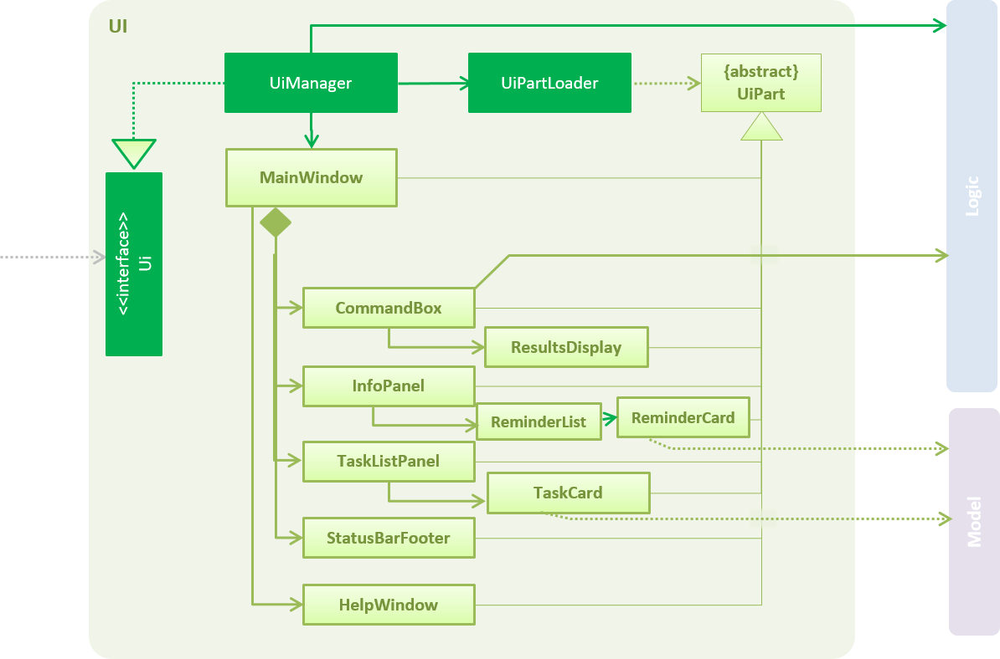
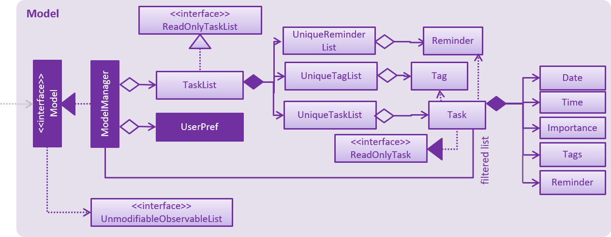

# Developer Guide 

* [Setting Up](#setting-up)
* [Design](#design)	
	* [UI](#ui-component)
	* [Logic](#logic-component)
	* [Model](#model-component)
	* [Storage](#storage-component)
	* [Commons](#common-classes)
* [Implementation](#implementation)
* [Testing](#testing)
* [Dev Ops](#dev-ops)
* [Appendix A: User Stories](#appendix-a--user-stories)
* [Appendix B: Use Cases](#appendix-b--use-cases)
* [Appendix C: Non-Functional Requirements](#appendix-c--non-functional-requirements)
* [Appendix D: Glossary](#appendix-d--glossary)
* [Appendix E: Product Survey](#appendix-e--product-survey)

## Setting up

#### Prerequisites

1. **JDK `1.8.0_60`**  or later 

    > Having any Java 8 version is not enough.  
    This app will not work with earlier versions of Java 8.
    
2. **Eclipse** IDE
3. **e(fx)clipse** plugin for Eclipse
4. **Buildship Gradle Integration** plugin from the Eclipse Marketplace

#### Importing the project into Eclipse

1. Fork this repo, and clone the fork to your computer
2. Open Eclipse (Note: Ensure you have installed the **e(fx)clipse** and **buildship** plugins as given 
   in the prerequisites above)
3. Click `File` > `Import`
4. Click `Gradle` > `Gradle Project` > `Next` > `Next`
5. Click `Browse`, then locate the project's directory
6. Click `Finish`

  > * If you are asked whether to 'keep' or 'overwrite' config files, choose to 'keep'.
  > * Depending on your connection speed and server load, it can even take up to 30 minutes for the set up to finish
      (This is because Gradle downloads library files from servers during the project set up process)
  > * If Eclipse auto-changes any settings files during the import process, you can discard those changes.
  
#### Troubleshooting project setup

**Problem: Eclipse reports compile errors after new commits are pulled from Git**
* Reason: Eclipse fails to recognize new files that appeared due to the Git pull. 
* Solution: Refresh the project in Eclipse:  
  Right click on the project (in Eclipse package explorer), choose `Gradle` -> `Refresh Gradle Project`.
  
**Problem: Eclipse reports some required libraries missing**
* Reason: Required libraries may not have been downloaded during the project import. 
* Solution: [Run tests using Gradle](UsingGradle.md) once (to refresh the libraries).
 

## Design

### Architecture

 
The **_Architecture Diagram_** given above explains the high-level design of the App.
Given below is a quick overview of each component.

`Main` has only one class called [`MainApp`](../src/main/java/seedu/inbx0/MainApp.java). MainApp has two functions:
* At app launch: The MainApp class initializes the components (or classes) in the correct sequence, and connects them up with each other.
* At shut down: The MainApp class shuts down the components and invokes the cleanup method, where necessary.

[**`Commons`**](#common-classes) represents a collection of classes used by multiple other components.
Two of those classes play important roles at the architecture level.
* `EventsCentre`: This class (written using [Google's Event Bus library](https://github.com/google/guava/wiki/EventBusExplained))
  is used by components to communicate with other components using events (i.e. a form of _Event Driven_ design)
* `LogsCenter`: Used by many classes to write log messages to the App's log file.

The rest of the App consists of four components:
* [**`UI`**](#ui-component): The UI of the App.
* [**`Logic`**](#logic-component): The command executor.
* [**`Model`**](#model-component): Holds the data of the App in-memory.
* [**`Storage`**](#storage-component): Reads data from, and writes data to, the hard disk.

Each of the four components
* Defines its _API_ in an `interface` with the same name as the Component.
* Exposes its functionality using a `{Component Name}Manager` class.

For example, the `Logic` component (see the class diagram given below) defines it's API in the `Logic.java`
interface and exposes its functionality using the `LogicManager.java` class. 
 

The _Sequence Diagram_ below shows how the components interact with each other in the scenario where the user issues the
command `delete 1`.

>Note how the `Model` simply raises a `TaskListChangedEvent` when the Task List data is changed,
 instead of asking the `Storage` to save the updates to the hard disk.

The diagram below shows how the `EventsCenter` reacts to that event, which eventually results in the updates
being saved to the hard disk and the status bar of the UI being updated to reflect the 'Last Updated' time.  

> Note how the event is propagated through the `EventsCenter` to the `Storage` and `UI` without `Model` having
  to be coupled to either of them. This is an example of how this Event Driven approach helps us reduce direct 
  coupling between components.

The sections below provide more detailed explanations for each component.

### UI component

 

**API** : [`Ui.java`](../src/main/java/seedu/inbx0/ui/Ui.java)

The UI consists of a `MainWindow` that is made up of multiple different parts e.g.`CommandBox`, `ResultDisplay`, `TaskListPanel`,
`StatusBarFooter`, `InfoPanel` etc. All these, including the `MainWindow`, inherit from the abstract `UiPart` class
and they can be loaded using the `UiPartLoader`.

The `UI` component uses the JavaFx UI framework. The layout of these UI parts are defined in matching `.fxml` files
 that are in the `src/main/resources/view` folder. 
 For example, the layout of the [`MainWindow`](../src/main/java/seedu/inbx0/ui/MainWindow.java) is specified in
 [`MainWindow.fxml`](../src/main/resources/view/MainWindow.fxml)

The `UI` component,
1. Executes user commands using the `Logic` component.
2. Binds itself to specific data in the `Model` component so that the UI can auto-update when this data in the `Model` component changes.
3. Responds to events raised from various parts of the App and updates the UI accordingly.

### Logic component

 

**API** : [`Logic.java`](../src/main/java/seedu/inbx0/logic/Logic.java)

1. `Logic` uses the `Parser` class to parse the user command.
2. This results in a `Command` object which is executed by the `LogicManager`.
3. The command execution can affect the `Model` (e.g. adding a task) and/or raise events.
4. The result of the command execution is encapsulated as a `CommandResult` object which is passed back to the `Ui`.

Given below is the Sequence Diagram for interactions within the `Logic` component for the `execute("delete 1")`
 API call. 
 

<!--- @@author A0139579J -->
####Commands

Each command inherits the implementation of the abstract class Command.  
The commands mainly consist of constructors and the execute method inherited from the abstract class Command.  

#####Add Command

The Add Command has various constructors catering to the various tasks such as floating, events and deadline tasks.  

| Constructor & Description                                                                                                                                                        |
|----------------------------------------------------------------------------------------------------------------------------------------------------------------------------------|
| public AddCommand(String name, String startDate, String startTime, String endDate, String endTime, String level, Set&lt;String&gt; tags)   Constructs the Add Command for Events with Importance |
| public AddCommand(String name, String startDate, String startTime, String endDate, String endTime, Set&lt;String&gt; tags)    Constructs the Add Command for Events with no Importance            |
| public AddCommand(String name, String level, Set&lt;String&gt; tags)    Constructs the Add Command for Floating Tasks with Importance                                                             |
| public AddCommand(String name, Set&lt;String&gt; tags)    Constructs the Add Command for Floating Tasks with no Importance                                                                        |
| public AddCommand(String name, String endDate, String endTime, String level, Set&lt;String&gt; tags)    Constructs the Add Command for Deadline Tasks with Importance                             |
| public AddCommand(String name, String endDate, String endTime, Set&lt;String&gt; tags)    Constructs the Add Command for Deadline Tasks with Importance                                           |

#####Delete Command

The Delete Command removes the task from the tasklist based on the index number that is given.

| Constructor & Description                                                                                                                                                        |
|----------------------------------------------------------------------------------------------------------------------------------------------------------------------------------|
| public DeleteCommand(int targetIndex)   Constructs the Delete Command given the index number for the task that is to be deleted |

#####Edit Command

The Edit Command changes the atrributes of a particular task that are specified by the user.

| Constructor & Description                                                                                                                                                        |
|----------------------------------------------------------------------------------------------------------------------------------------------------------------------------------|
| public EditCommand(int targetIndex, String [] argumentsToEdit, Set&lt;String&gt; tags)   Constructs the Edit Command given the index number for the task that is to be edited and the arguments to be edited |

| Type            |  Methods and Description                                                                                                                           |
|--------------------|-----------------------------------------------------------------------------------------------------------------------------|
| UniqueTagList      | obtainUniqueTagList(ReadOnlyTask taskToEdit)    Returns the UniqueTagList from the task that is chosen to be edited           |
| UniqueReminderList | obtainUniqueReminderList(ReadOnlyTask taskToEdit)    Returns the UniqueReminderList from the task that is chosen to be edited |
| Task | updateReminders(Task toEditWith)    Updates all the Reminders in the Task with the new task arguments so that it will be correctly displayed to the user|
| String[] | obtainArguments(String[] editArguments, ReadOnlyTask taskToEdit)    Retrieves all the arguments that the user wish to keep the same from the task and returns all the arguments as a String Array|
| Task | createToEditWithTask(String[] editArguments, UniqueTagList tags, UniqueReminderList reminders)    Returns the new Task with the new edited attributes|

#####Remind Command

The Remind Command adds a reminder to a task specified by the user.

| Constructor & Description                                                                                                                                                        |
|----------------------------------------------------------------------------------------------------------------------------------------------------------------------------------|
| public RemindCommand(int targetIndex, String date)   Constructs the Remind Command given the index number of the task that the reminder is added to and the start date of the reminder |

| Type            |  Methods and Description                                                                                                                           |
|--------------------|-----------------------------------------------------------------------------------------------------------------------------|
| UniqueTagList      | obtainUniqueTagList(ReadOnlyTask taskToAddReminder)    Returns the UniqueTagList from the task that is going to have a reminder added |
| UniqueReminderList | addReminder(ReadOnlyTask taskToAddReminder, ReminderTask newReminder)    Adds the reminder to the UniqueReminderList from the task that is chosen to have reminder added and returns the UniqueReminderList |
| boolean | isValidDateAndTime(Date date, Time time)    Checks if the time and date given is valid and not in the past|
| String[] | obtainArguments(String[] arguments, ReadOnlyTask taskToAddReminder)    Retrieves all the arguments from the task that is going to have a reminder added and returns all the arguments as a String Array|
| Task | createTaskWithReminder(ReadOnlyTask taskToAddReminder, ReminderTask newReminder)    Returns the new Task with the new added reminder|

#####Select Command

The Select Command selects a task specified by the index number from the shown list and displays the task's details in the info panel.

| Constructor & Description                                                                                                                                                        |
|----------------------------------------------------------------------------------------------------------------------------------------------------------------------------------|
| public SelectCommand(int targetIndex)   Constructs the Select Command given the index number for the task that is to be selected |

#####Find Command

The Find Command allows the user to search for tasks based on the arguments given.

| Constructor & Description                                                                                                                                                        |
|----------------------------------------------------------------------------------------------------------------------------------------------------------------------------------|
| public FindCommand(boolean logicRelation, List&lt;String&gt; keywordSet)   Constructs the Find Command given the various arguments given and if there is any logical operator |

#####Clear Command

The Clear Command allows the user to clear the entire tasklist or clear the shown list.

| Constructor & Description                                                                                                                                                        |
|----------------------------------------------------------------------------------------------------------------------------------------------------------------------------------|
| public ClearCommand(String toClear)   Constructs the Clear Command based on the user input whether it is the entire tasklist or the shown list |

#####List Command

The List Command displays the various lists to the user based on input.

| Constructor & Description                                                                                                                                                        |
|----------------------------------------------------------------------------------------------------------------------------------------------------------------------------------|
| public ListCommand()   Constructs the List Command to show the entire list of undone tasks |
| public ListCommand(String arguments)   Constructs the List Command to show tasks due by a certain date or tasks on a certain date |

#####Mark Complete Command

The Mark Complete Command marks a certain task as completed specified by the index number.

| Constructor & Description                                                                                                                                                        |
|----------------------------------------------------------------------------------------------------------------------------------------------------------------------------------|
| public MarkCompleteCommand(Set<Integer> indexNumSet)   Constructs the Mark Complete Command given a set of index numbers |

| Type            |  Methods and Description                                                                                                                           |
|--------------------|-----------------------------------------------------------------------------------------------------------------------------|
| void | validateSet(Set&lt;Integer&gt; indexNumSet)    Checks if the index numbers given are valid |
| void | sortIndexNumInDescendingOrder()    Sorts the set of index numbers in a descending order in preparation of marking those tasks complete |

#####Add Tag Command

The Add Tag Command allows the user to add tags to a task's existing tag list.

| Constructor & Description                                                                                                                                                        |
|----------------------------------------------------------------------------------------------------------------------------------------------------------------------------------|
| public AddTagCommand(int targetIndex,  Set&lt;String&gt; tags)   Constructs the Add Tag Command given a set of of Strings which are the tags and the index number of the task that the tags are going to be added to |

| Type            |  Methods and Description                                                                                                                           |
|--------------------|-----------------------------------------------------------------------------------------------------------------------------|
| UniqueTagList      | obtainUniqueTagList(ReadOnlyTask taskToEdit))    Returns the UniqueTagList from the task that is going to have the tags added |
| Task | createToEditWithTask(ReadOnlyTask taskToEdit, UniqueTagList tags)    Returns the new Task with the new added tags|

#####Delete Tag Command

The Delete Tag Command allows the user to remove tags from a task's existing tag list.

| Constructor & Description                                                                                                                                                        |
|----------------------------------------------------------------------------------------------------------------------------------------------------------------------------------|
| public DelTagCommand(int targetIndex,  Set&lt;String&gt; tags)   Constructs the Delete Tag Command given a set of of Strings which are the tags and the index number of the task that the tags are going to be removed from |

| Type            |  Methods and Description                                                                                                                           |
|--------------------|-----------------------------------------------------------------------------------------------------------------------------|
| UniqueTagList      | obtainUniqueTagList(ReadOnlyTask taskToEdit)    Returns the UniqueTagList from the task that is going to have the tags removed |
| Task | createToEditWithTask(ReadOnlyTask taskToEdit, UniqueTagList tags)    Returns the new Task with the tag list that had the tags removed|

#####Show Command

The Show Command navigates to the various filtered lists.

| Constructor & Description                                                                                                                                                        |
|----------------------------------------------------------------------------------------------------------------------------------------------------------------------------------|
| public ShowCommand (String filterCondition)   Constructs the Show Command which will display the list based on the filter condition |

#####Sort Command

The Sort Command sorts the tasks in the tasklist.

| Constructor & Description                                                                                                                                                        |
|----------------------------------------------------------------------------------------------------------------------------------------------------------------------------------|
| public SortCommand(String type, boolean defaultOrder)   Constructs the Sort Command given the type of sort and whether in ascending or descending order |

#####Set Directory Command

The Set Directory Command allows the user to specify the file path of the storage of the tasklist.

| Constructor & Description                                                                                                                                                        |
|----------------------------------------------------------------------------------------------------------------------------------------------------------------------------------|
|  public SetDirCommand (String filePath)   Constructs the Set Directory Command given the filepath of which the tasklist is to be stored |

#####Undo Command

The Undo Command allows the user to undo any previous action.

| Constructor & Description                                                                                                                                                        |
|----------------------------------------------------------------------------------------------------------------------------------------------------------------------------------|
| public UndoCommand()   Constructs the Undo Command which will undo the previous action |
| public UndoCommand(int stepsBack)   Constructs the Undo Command which will undo the number of actions given|

#####Redo Command

The Redo Command allows the user to redo previous undone action.

| Constructor & Description                                                                                                                                                        |
|----------------------------------------------------------------------------------------------------------------------------------------------------------------------------------|
| public RedoCommand()   Constructs the Redo Command which will redo the previous undone action |
| public RedoCommand(int stepsBack)   Constructs the Redo Command which will redo the number of undo actions given|

#####Help Command

The Help Command displays the help window by raising a ShowHelpRequestEvent.

#####Exit Command

The Exit Command terminates the program by raising an ExitAppRequestEvent.

<!--- @@author  -->
### Model component

 

**API** : [`Model.java`](../src/main/java/seedu/inbx0/model/Model.java)

The `Model`,
* stores a `UserPref` object that represents the user's preferences.
* stores the Task List data.
* exposes a `UnmodifiableObservableList<ReadOnlyTask>` that can be 'observed' e.g. the UI can be bound to this list
  so that the UI automatically updates when the data in the list changes.
* does not depend on any of the other three components.

<!--- @@author A0139579J -->
####Task

The Task object represents a task in the tasklist.

| Constructor & Description                                                                                                                                                        |
|----------------------------------------------------------------------------------------------------------------------------------------------------------------------------------|
| public Task(final Name name, final Date startDate, final Time startTime, final Date endDate, final Time endTime, final Importance level, final UniqueTagList tags, final UniqueReminderList reminders)   Constructs the Task object which wil the contain a Name object, two Date objects, two Time objects, one Importance object, one UniqueTagList and one UniqueReminderList |
| public Task(final Name name, final Date startDate, final Time startTime, final Date endDate, final Time endTime, final Importance level, final UniqueTagList tags, final UniqueReminderList reminders, final boolean isCompleted, final boolean isExpired, final boolean isFloatTask)   Constructs the Task object which wil the contain a Name object, two Date objects, two Time objects, one Importance object, one UniqueTagList and one UniqueReminderList and with all the specific boolean values|

| Type            |  Methods and Description                                                                                                                           |
|--------------------|-----------------------------------------------------------------------------------------------------------------------------|
| boolean | isValidEvent(final Date startDate, final Time startTime, final Date endDate, final Time endTime)    Returns the boolean value if the task is a valid event |
| Name | getName()    Returns the Name object of the task|
| Date | getStartDate()    Returns the start date of the task which is a Date object|
| Time | getStartTime()    Returns the start time of the task which is a Time object|
| Date | getEndDate()    Returns the end date of the task which is a Date object|
| Time | getEndTime()    Returns the end time of the task which is a Time object|
| Importance | getLevel()    Returns the Importance object of the task |
| UniqueTagList | getTags()    Returns the UniqueTagList of the task |
| UniqueReminderList | getReminders()    Returns the UniqueReminderList of the task |
| boolean | getIsCompleted()    Returns boolean value of the task on whether the task is completed |
| boolean | getIsExpired()    Returns boolean value of the task on whether the task is expired |
| boolean | getIsFloatTask()    Returns boolean value of the task on whether the task is a floating task |
| boolean | getIsEvent()    Returns boolean value of the task on whether the task is an event |
| void | setTags(final UniqueTagList replacement)    Replaces the task's tags with tags in the argument tag list |
| void | setStartDate(final Date startDate)    Replaces the task's start date with Date Object in the argument |
| void | setStartTime(final Time startTime)    Replaces the task's start time with Time Object in the argument |
| void | setEndDate(final Date endDate)    Replaces the task's end date with Date Object in the argument |
| void | setEndTime(final Time endTime)    Replaces the task's end time with Time Object in the argument |
| void | setLevel(final Importance level)    Replaces the task's importance with Importance Object in the argument |
| void | setCompleted(final boolean isCompleted)    Changes the boolean variable of whether the task is completed with the boolean value in the argument |
| void | setExpired(final boolean isExpired)    Changes the boolean variable of whether the task is expired with the boolean value in the argument |
| void | setFloatTask(final boolean isFloatTask)    Changes the boolean variable of whether the task is a floating task with the boolean value in the argument |
| void | setReminders(final UniqueReminderList reminders)    Replaces the task's reminders with reminders in the argument reminder list |
| boolean | equals(final Object other)    Compares the specified task if it is the same as another task |
| int | hashCode()    Returns the hash code value of the task |
| String | toString()    Returns the string representation of the task |

<!--- @@author  -->
### Storage component

 

**API** : [`Storage.java`](../src/main/java/seedu/inbx0/storage/Storage.java)

The `Storage` component,
* can save `UserPref` objects in a Json format and read it back.
* can save the Task List data in an XML format and read it back.

### Common classes

Classes used by multiple components are in the `seedu.inbx0.commons` package.

## Implementation

### Logging

We are using the `java.util.logging` package for logging. The `LogsCenter` class is also being used to manage the logging levels
and logging destinations.

* The logging level can be controlled using the `logLevel` setting in the configuration file
  (See [Configuration](#configuration))
* The `Logger` for a class can be obtained using `LogsCenter.getLogger(Class)` which will log messages according to
  the specified logging level
* Currently log messages are output through: `Console` and to a `.log` file.

**Logging Levels**

* `SEVERE` : Critical problem detected which may possibly cause the termination of the application
* `WARNING` : Can continue, but with caution
* `INFO` : Information showing the noteworthy actions by the App
* `FINE` : Details that is not usually noteworthy but may be useful in debugging
  e.g. print the actual list instead of just its size

### Configuration

Certain properties of the application can be controlled (e.g App name, logging level) through the configuration file 
(default: `config.json`):

## Testing

Tests can be found in the `./src/test/java` folder.

**In Eclipse**:
* To run all tests, right-click on the `src/test/java` folder and choose
  `Run as` > `JUnit Test`
* To run a subset of tests, you can right-click on a test package, test class, or a test and choose
  to run it as a JUnit test.

**Using Gradle**:
* See [UsingGradle.md](UsingGradle.md) for more information on how to run tests using Gradle.

We have two types of tests:

1. **GUI Tests** - These are _System Tests_ that test the entire App by simulating user actions on the GUI. 
   These are in the `guitests` package.
  
2. **Non-GUI Tests** - These are tests not involving the GUI. They include,
   1. _Unit tests_ targeting the lowest level methods/classes.  
      e.g. `seedu.inbx0.commons.UrlUtilTest`
   2. _Integration tests_ that are checking the integration of multiple code units 
     (those code units are assumed to be working). 
      e.g. `seedu.inbx0.storage.StorageManagerTest`
   3. Hybrids of unit and integration tests. These test are checking multiple code units as well as 
      how the are connected together. 
      e.g. `seedu.inbx0.logic.LogicManagerTest`
  
**Headless GUI Testing** :
Thanks to the [TestFX](https://github.com/TestFX/TestFX) library we use,
 our GUI tests can be run in the _headless_ mode. 
 In the headless mode, GUI tests do not show up on the screen.
 That means the developer can do other things on the Computer while the tests are running. 
 See [UsingGradle.md](UsingGradle.md#running-tests) to learn how to run tests in headless mode.
 
#### Troubleshooting tests
 **Problem: Tests fail because NullPointException when AssertionError is expected**
 * Reason: Assertions are not enabled for JUnit tests. 
   This can happen if you are not using a recent Eclipse version (i.e. _Neon_ or later)
 * Solution: Enable assertions in JUnit tests as described 
   [here](http://stackoverflow.com/questions/2522897/eclipse-junit-ea-vm-option).  
   Delete run configurations which may have been created when you ran tests earlier.
  
## Dev Ops

### Build Automation

See [UsingGradle.md](UsingGradle.md) to learn how to use Gradle for build automation.

### Continuous Integration

We use [Travis CI](https://travis-ci.org/) to perform _Continuous Integration_ on our projects.
See [UsingTravis.md](UsingTravis.md) for more details.

### Making a Release

Here are the steps to create a new release.
 
 1. Generate a JAR file [using Gradle](UsingGradle.md#creating-the-jar-file).
 2. Tag the repo with the version number. e.g. `v0.1`
 2. [Crete a new release using GitHub](https://help.github.com/articles/creating-releases/) 
    and upload the JAR file your created.
   
### Managing Dependencies

A project often depends on third-party libraries. For example, Inbx_0 depends on the
[Jackson library](http://wiki.fasterxml.com/JacksonHome) for XML parsing. Managing these _dependencies_
can be automated using Gradle. For example, Gradle can download the dependencies automatically, which
is better than these alternatives. 
a. Include those libraries in the repo (this bloats the repo size) 
b. Require developers to download those libraries manually (this creates extra work for developers) 

## Appendix A : User Stories

Priorities: High (must have) - `* * *`, Medium (nice to have)  - `* *`,  Low (unlikely to have) - `*`

Priority | As a ... | I want to ... | So that I can...
-------- | :-------- | :--------- | :-----------
`* * *` | new user | see usage instructions | refer to instructions when I forget how to use the App
`* * *` | user | add a new task |
`* * *` | user | edit details of a task | make changes to tasks
`* * *` | user | delete a task | remove entries that I no longer need
`* * *` | user | to mark tasks as done | keep track of completed tasks 
`* * *` | user | find a task by name | locate details of tasks without having to go through the entire list
`* *`   | user | categorise my tasks by date | view which tasks are due on certain dates
`* *`   | user | change storage location | access the file data easily
`*`     | user | undo last action taken | rectify any accidental mistakes
`*`     | user | be reminded of upcoming tasks | remember tasks
`*`     | user | auto-complete my commands | be more efficient with typing commands

## Appendix B : Use Cases

(For all use cases below, the **System** can be interpreted as the `Inbx_0` application and the **Actor** as the `user`, unless specified otherwise)

#### Use case: Add task

**MSS**

1. User requests to add a task
2. Inbx_0 creates the task and saves it into the storage file  
Use case ends.

**Extensions**

1a. User requests to add a [duplicate task](#duplicate-task)
> 1a1. Inbx_0 shows an error message  
  Use case ends

1b. Inbx_0 detects an error in the data entered
 >   1b1. Inbx_0 requests for the correct data
     1b2. User enters new data  
     Steps 1b1-1b2 are repeated until data contains no errors
     Use case resumes from step 2.

#### Use case: List all tasks

**MSS**

1. User requests to list all tasks
2. Inbx_0 shows the list of tasks  
Use case ends.

**Extensions**

2a. The list is empty

> Use case ends

#### Use case: List all tasks that are due before a specific date

**MSS**

1. User requests to list tasks that are due before a specific date
2. Inbx_0 retrieves the required tasks and displays them in a list  
Use case ends.

**Extensions**

2a. The list is empty

> Use case ends

#### Use case: Delete task

**MSS**

1. User requests to list tasks
2. Inbx_0 shows a list of tasks
3. User requests to delete a specific task in the list
4. Inbx_0 deletes the task  
Use case ends.

**Extensions**

2a. The list is empty

> Use case ends

3a. The given index is invalid

> 3a1. Inbx_0 shows an invalid INDEX error message  
  Use case resumes at step 2

#### Use case: Undo add task

**MSS**

1. User requests to undo his add task action
2. Inbx_0 deletes the most recenty added task  
Use case ends.

#### Use case: Undo delete task

**MSS**

1. User requests to undo his delete task action
2. Inbx_0 re-adds the most recenty deleted task  
Use case ends.

#### Use case: Clear the tasklist

**MSS**

1. User requests to clear the list of tasks
2. Inbx_0 deletes the entire task list  
Use case ends.

## Appendix C : Non Functional Requirements

1. Should work on any [mainstream OS](#mainstream-os) as long as it has Java `1.8.0_60` or higher installed.
2. Should be able to hold up to 5000 tasks.
3. Should come with automated unit tests and open source code.
4. Should favor DOS style commands over Unix-style commands.
5. Should work offline without any internet connection.
6. Should save the data in a human editable XML file.
7. Should be standalone without depending on any external plugin.
8. Should not require any installer.

## Appendix D : Glossary

##### Mainstream OS

> Windows, Linux, Unix, OS-X

##### IDE

> An Integrated Developement Environment used to develop the application.

##### UI

> The User Interface that is presented to the user.

##### Duplicate Task

> A task that has the same name, start date, start time, end date and end time.

## Appendix E : Product Survey

A Product Survey was conducted to study existing products on the market to gather insights and inspiration for our own product. We looked at various Task Managers on the market such as Google Calendar, Wunderlist, Todo.txt, Evernote and Google Keep. We then evaluated their common features and benefits that they offer to the consumers. We will then implement the more useful features while leaving out the more superfluous ones.

For Google Keep, the application has a colorful design and a simple interface to use. It has both a mobile and desktop version, which synchronises with each other whenever a change is made. Users can add Notes, Lists or Reminders. Users can type anything they want into the text fields and even add images to the notes themselves. Notes can be shared with multiple people via email, useful for keeping a shared note such as grocery lists or todo lists. While it is possible to set reminders for individual notes, there is no way to represent the whole list of notes in chronological order as it is up to the user to shift the Notes Cards around the UI as they wish.

S Planner has vaious fields for adding a event including location, reminders and allow users to repeat events.
It has a friendly calendar interface where events would show up on the day of the calendar. 
The disadvantage is that it only allows events which require start date, start time, end date and end time.

Todoist has a beautiful and colorful user interface, with option provided for user to set their preference regarding
 on keyword shortcut and notification. It has chrome and app version with support cross platform use with synchronization. 
It can process and auto analyze different format of time input, and support different input of tasks like event, deadline and 
recursive task. User can categorize their tasks and add PDF, excel form or even image to their tasks to add in more detail.
 It support notification via email and app notification on mobile to remind users. User can also drag the task to delay it.
The disadvantage is that it does not give any clear instruction for new user while at the same time, it does not analyze the
 input very clear, so it may misunderstand user input but still accept it without notifying the user.  Besides, although it can 
delay task by dragging it, the only option is tomorrow, which is no that user friendly. Moreover, when user want to 
synchronize their data across platform, they have to click 'synchronization'.

Wunderlist has a reactive, clean aesthetic design with web-based platform support (Google Chrome, Firefox and Safari), desktop support (Windows and Mac) and mobile support (Android, iOS, Windows Phone). It adopts a freemium model which gives users essential functionality, (in this case, a limit on the number of task lists you are allowed to have as well as on the file size of uploads), with the option to upgrade to more premium functionalities at a monthly charge. Wunderlist has strong cross-platform integration, in terms of mobile to desktop as well as strong collaborative support for teams looking to assign tasks and sub-tasks. It can also integrate into popular productivity applications such as slack, to make communication and task-allocation in a professional setting more painless. Some of the cons however, are the lack of natural language processing for tasks with recurring deadlines, lack of support for location-based reminders and the steep fees for premium subscription. Overall at a basic level, it has some very strong features for a free app.

| S/N | Type Of Product | Pro                                                                                                                                                                                | Con                                                                                                          |
|-----|-----------------|------------------------------------------------------------------------------------------------------------------------------------------------------------------------------------|--------------------------------------------------------------------------------------------------------------|
|  1  | Google Keep     |  - Colorful design and a simple interface to use   - Adds Notes, Lists or Reminders                                                                                                 | - Cannot represent the whole list of notes in chronological order                                            |
|  2  | S Planner       |  - Friendly calendar interface    - Adds Events, Reminders, Recurring Events                                                                                                         | - Inflexible as it only allows events with a start and end                                                   |
|  3  | Todoist         | - Colorful interface with user customization   - Parses different formats of time input - Adds Events, Deadline Tasks, Recursive Tasks   - Notification to users through email and app | - Not beginner friendly and not user friendly   - Inflexible in changing task's date                           |
|  4  | Wunderlist      | - Clean aesthetic design   - Adds tasks and subtasks                                                                                                                                 | - Lack of natural language processing for recurring deadlines   - Lack of support for location-based reminders |