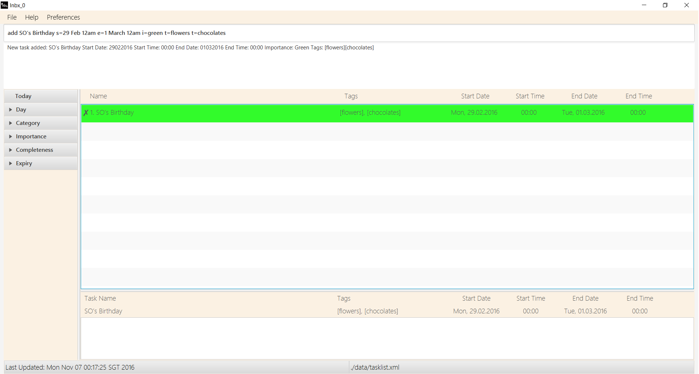
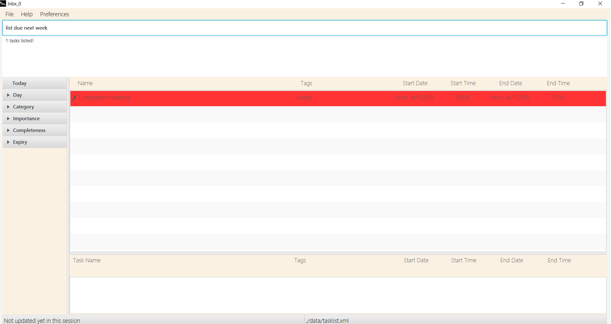
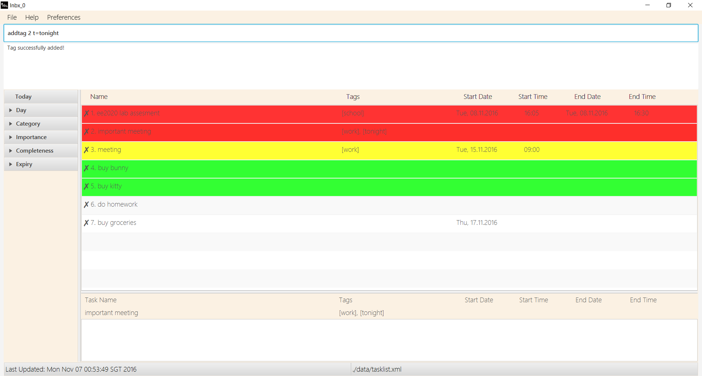

<!--- @@author A0135797M -->
# User Guide

 > 
 
##**Table Of Contents**
* [About](#about)
* [Quick Start](#quick-start)
* [Features](#features)
	* [Getting help: `help`](#help)
	* [Adding a task: `add`](#add)
	* [Listing tasks: `list`](#list)
	* [Finding specific tasks: `find`](#find)
	* [Sorting the tasks by using a specific criteria: `sort`](#sort)
	* [Showing the various filtered lists: `show`](#show)
	* [Editing a task: `edit`](#edit)
	* [Modifying the taglist: `addtag` / `deltag`](#tag)
	* [Deleting a task: `del`](#del)
	* [Selecting a task : `sel`](#sel)
	* [Undoing previous action: `undo`](#undo)
	* [Redoing previous action: `redo`](#redo)
	* [Clearing all tasks : `clr`](#clr)
	* [Marking a task as completed : `done`](#done)
	* [Setting a reminder for your task : `rem`](#reminder)
	* [Saving your tasklist to a specific directory : `saveas`](#setdir)
	* [Exiting the program : `exit`](#exit)
	* [Autocompleting with command history](#autocomplete)
	* [Displaying expired and overdue tasks](#overdue)
       * [Changing the theme and size of inbx_0] (#preferences)
* [Command Summary](#command-summary)
* [FAQ](#faq)

##**About**
Inbx_0 (pronounced as Inbox Zero) is a personal task managing assistant that helps to keep your tasks in order. It will help you manage your email inbox easily so as to keep your inbox uncluttered. 

Unlike all the other task managers out there, Inbx_0 is a simple program that runs on single-line commands. Inbx_0 will execute your commands based on what you type immediately. No more looking for buttons and menus to get the program to do what you want. So let's get started!

## **Quick Start**

0. Ensure you have Java version `1.8.0_60` or later installed in your Computer. 
   > Having any Java 8 version is not enough.  
   This app will not work with earlier versions of Java 8.
   
1. Download the latest `inbx_0.jar` from the [releases](../../../releases) tab.
2. Copy the file to the folder you want to use as the home folder for inbx_0
3. Double-click the inbx_0 icon
4. Double-click the Task Manager.jar file to start the app. The GUI should appear in a few seconds. 
 > 

5. Type a command in the command box and press <kbd>Enter</kbd> to execute it.  
   e.g. typing **`help`** and pressing <kbd>Enter</kbd> will open the help window. 
6. Some example commands you can try:
   * **`add`**:`add EE2020 Midterms` :  adds a task called `EE2020 Midterms` to the Task Manager
   * **`list`** : lists all tasks
   * **`delete`**`1` : deletes the 1st task shown in the current list
   * **`undo`**`1` : undoes the last command
   * **`exit`** : exits the app
7. Refer to the [Features](#features) section below for details of each command. 

## **Features**

Inbx_0 can perform multiple different functions based on various commands that you type into the command line. There is a certain command format for each command and the general format can be described as such: 

**Command Format**  
1.  Words in `UPPER_CASE` are  parameters that are compulsory and will be taken in by the app (e.g. NAME, DATE). 
 
2. Items in `SQUARE_BRACKETS` are optional and will not be required in order to perform the command (e.g. [tags], [date]).
 
3. Items with `...` after them can have multiple instances. This means that there can be more than one occurrence of the particular item. For example, “[t/TAG]...” means that you can have multiple tags. 
 
4.  The order of parameters is fixed and needs to be strictly followed.

Parameter | Description
---------|:---------
[TASK] | Name of the task 
[s=START_DATE] | The date that the task will start on 
[st=START_TIME] | The time of the start of the task 
[e=END_DATE] | The date of the task that the task will end on 
[et=END_TIME] | The time of the end of the task 
[i=IMPORTANCE] | The priority of the task. Can be `green`, `yellow` or `red`, from low to high importance 
[t=TAGS] | Tags that are assigned to the task 

>  For Dates and Times, the program utiilises natural language processing. This means that you can enter commands in multiple formats such as "tmr, next week, next wed, 3 days later, noon, 8am, 1400" and inbx_0 will read them just fine!  

The `IMPORTANCE` parameter takes in variations of the colours `red`, `green` or `yellow`, such as `Red, Green, Yellow`, `r, g, y`, or `R, G, Y`.

The rest of the guide will be using the general command format to describe what is needed to execute each command.

  

#### 1. Getting help: `help`
Format: `help`

If you ever get confused while using our app, typing in help will instantly open up a help window, showing you the complete list of commands that you can enter, instantly putting you back on the right path! 

> 

  
 
<!--- @@author A0139579J -->

#### 2. Adding a task: `add`
Let's get started by adding tasks to the tasklist! You may use any of the formats below to get started.

1) Add a floating task. 
Format: `add TASK [i=IMPORTANCE] [t=TAGS]...` 

> Floating tasks are tasks without any start dates or end dates. You can use this to keep track of tasks which may not be follow
a time schedule.

Examples: 
* `add Buy Groceries`  
* `add Wash dishes i=green`  
* `add Buy bunny i=green t=cute`  
 

2) Add a task with deadlines. 
Format: `add TASK e=[END_DATE] [END_TIME] [i=IMPORTANCE] [t=TAGS]...` 

Examples: 
* `add Do CS2103 Homework e=tomorrow i=red`
* `add Finish Project Paper e=1 March 12am i=green t=GEH1027`  
 

> * Under the e= parameter, it requires either the END_DATE or END_TIME. By providing only END_DATE, the END_TIME would not be specified.
> *	If the END_DATE is not provided, the end date will be automatically assigned as the current date.

3) Add a task with starting point only. 
Format: `add TASK s=[START_DATE] [START_TIME][i=IMPORTANCE] [t=TAGS]...`

Examples: 
* `add Started Gym Training s=10012016 10am i=red`
* `add On Diet s=18/10/2016 i=y t=health`  
 

> * Under the s= parameter, it requires either the START_DATE or START_TIME. By providing only START_DATE, the START_TIME would not be specified.
> *	If the START_DATE is not provided, the start date will be automatically assigned as the current date.

4) Add an event. 
Format: `add TASK s=[START_DATE] [START_TIME] e=[END_DATE] [END_TIME] [i=IMPORTANCE] [t=TAGS]...`

> Events are tasks with a starting and ending point.

Examples:
* `add Doctor's appointment s=2 July 2016 5pm e=2 July 2016 7:30pm i=green t=painful`
* `add SO’s Birthday s=29 Feb 12am e=1 March 12am i=green t=flowers t=chocolates`

 > 

  

#### 3. Listing tasks: `list`
1) Listing all the tasks.  
Format: `list [DATE]`

The List Command shows a list of all tasks in the task manager so that you can take a look at your tasks all at one go.

 There will be index numbers allocated at the side of each task which will be needed for other operations such as deleting a task or selecting a task.
 
If you input a date, it will show all the tasks associated with that date.

2) Listing tasks due before a specific date.  
Format: `list due DATE`

You will be able to view all of today’s tasks and tasks that are due before a specific date. By keying in `list due DATE`, it will display a list of all the tasks due before the input date in the task manager.

Examples:
* `list due tomorrow` shows every task from now to the end of tomorrow  
* `list due 1st Jan` shows every task from now till the end of 1st January 2017  

3) Listing tasks that are overdue  
Format: `list overdue`

You will be able to view all of the deadline tasks are overdue by typing the following: `list overdue`

 > 

  

<!--- @@author A0148044J-->
#### 4. Finding specific tasks: `find`
Want to search for important things that you need to do? Or know when is your next coming exam? If you need to find certain tasks by keywords, you can use the `find` command.

1. Normal search
Format: `find KEYWORD [MORE_KEYWORDS]...`

> * Normal search will display a task that matches at least one keyword (i.e. `OR` search).
> * You can use `INDICATOR/KEYWORD` to specify the keyword belong to a specific attributes, available INDICATOR: n=, s=, st=, e=, et=, i=
> * You can use `'` to replace the whitespace if one search keyword contains whitespace, or inbx_0 treat it as multiple keywords
 eg: `do'CS2103'homework` will match `do CS2103 homework' 
> * Tasks matching at least one keyword will be returned (i.e. `OR` search).
> * Keywords are non case-sensitive, ie, `homework` will match `HOMEWORK`
> * The order of the keywords does not matter. e.g. `Movie Night` will match `Night Movie`
> * Only full words will be matched e.g. `visit` will not match `visiting`

Example: 
* `find meeting CS2103quiz` will return `MEETING` or `CS2103Quiz` but not `meeting with CS2103 tutor` or `quiz` 

2. Logic operation search

> Format:  `[LOGIC_OPERATOR] KEYWORD [MORE_KEYWORDS] [MORE_LOGIC_OPERATOR]...`

> * Logic operation search will display a task only when it fits the logic expression
> * LOGIC_OPERATOR: `|` means OR, `&` means AND, `(` and `)` used to group the logic operations
> * You can use `INDICATOR/KEYWORD` to specify the keyword belong to a specific attributes, available INDICATOR: n=, s=, st=, e=, et=, i=
> * You can use any valid logic operation format
> * valid logic operation format: 
>  1. Brackets must be closed properly
>  2.  Keywords must not contains whitespace and any keywords cannot followed by another keyword without `LOGIC_OPERATOR` in between
>  3.  `|` `&` `(` cannot followed by '|' '&' )' without `keywords` in between

Examples:

* `find homework | assignment`: return  `homework` or `assignment`
* `find homework & e=tmr`: return `homework` that ends `tomorrow`
* `find (homework | assignment) & s=tmr & i=r`: return `homework` or `meeting` that start on `tomorrow` with high importance `Red`

 > 

  

#### 5. Sorting the tasks by using a specific criteria: `sort`
Format: sort `[NAME]`/`[START_TIME]`/`[END_TIME]`/`[IMPORTANCE]` `[ASCENDING]`/`[DESCENDING]`

The Sort Command

> * Sort the tasks according to name, start time, end time or importance in descending or ascending order
> * acceptable input for 
> * `NAME`: n, Name, `Start Time`: s, start, `End Time`: e, end, `Importance`: i, importance
> *  `ASCENDING`: ASC, ascending, ascend, `DECENDING`: DESC, descending, descend
> * All sort keywords are non-case sensitive, ie, `Importance` is `importance` 
> * Default sorting order is `ASCENDING` for Name, Start Time and End Time but `DESCENDING` for Importance

Examples:

* `sort i`: Sort the lists such that the importance of the tasks decrease
* `sort n DESC`: Sort the lists such that the name of the tasks is in the reverse of natural alphabet order 

 > 
 
    

#### 6. Showing the various filtered lists: `show`
Format: show `[DAY]`/`[CATEGORY]`/`[IMPORTANCE]`/`[COMPLETENESS]` /`[EXPIRED]`

The Show Command

> * Navigates the various filtered lists according to day, category, importance, completeness and whether the task has expired
> * acceptable input for 
> * `DAY`: mon, monday, `CATEGORY`: dea, deadline, `IMPORTANCE`: gre, green, `COMPLETENESS`: com, 
> *  `EXPIRED`: exp,  
> * All show keywords are non-case sensitive, ie, `WED` is `wed` 

Examples:

* `show green`: Navigates to the filtered list which contains those tasks that are green in importance

* `show tuesday`: Navigates to the filtered list which contains those tasks that are on tuesday

 > 
 
    
<!--- @@author  -->

<!--- @@author A0139579J -->
#### 7. Editing a task: `edit`
1) Editing any parameter of a task  
Format: `edit INDEX [n=NAME] [s=START_DATE] [st=START_TIME] [e=END_DATE] [et=END_TIME] [i=IMPORTANCE]`

Made a spelling mistake or your event was postponed? You can use the Edit Command to swiftly rectify any tasks on the task list.

This can be done by typing the following:

> edit INDEX [n=NAME] [s=START_DATE] [st=START_TIME] [e=END_DATE] [et=END_TIME] [i=IMPORTANCE] [t=TAG]...

By specifying the parameters of the task and typing the corrected parameters, you will be able to change multiple parameters in that
single task. Do note that one of the optional parameters is necessary.

Examples:
* `list today` 
  `edit 2 s=tomorrow` 
  Changes the 2nd task in today’s list to start tomorrow

* `find meeting`  
  `edit 1 n=Business Lunch st=1pm` 
  Changes the name of 1st task in the results of the `find` command to ‘Business Lunch at 1 pm’  

2) Converting a task to a floating task.  
Format: `edit INDEX float`

Use the keyword "float" to convert any task into a floating task by removing the starting and ending dates and times.

This can be done by typing the following: `edit INDEX float`  

Example:
* `edit 2 float` will convert the 2nd task in the list into a floating task.

 > 
 
  

<!--- @@author A0139481Y -->
#### 8. Modifying the taglist: `addtag` / `deltag`
1) Adding more tags
Format: `addtag INDEX t=TAGS [t=MORE_TAGS]`

If you wish to add additional tags to any existing tasks, you can do it by typing the following: `addtag INDEX t=TAGS [t=MORE_TAGS]`  

Note that adding tags and editing tags are different commands. Edit tags will remove all tags and add in the editted tag. This addtag command will just append the new tag behind any existing tag names.

Example: 
* `list today` 
  `addtag 2 t=tonight` 
   Adds the "tonight" tag to the 2nd task in the list.

2) Deleting a particular tag
Format: `deltag INDEX t=TAGS [t=MORE_TAGS]`

Is you wish to remove specific tags from the list of tags, simply type in `deltag INDEX t=TAGS [t=MORE_TAGS]` to remove it/them.

 > 

<!--- @@author  -->

  

#### 9. Deleting a task: `del`
Format: `del INDEX`

If you have wish to remove a particular task from the list, you can do it by typing the following: `del INDEX`   

Examples: 
* `list today` 
  `del 2` 
  Deletes the 2nd task in today’s list.

* `find meeting`  
  `del 1` 
  Deletes the 1st task in the results of the `find` command for ‘meeting’.

 >   

  

#### 10. Selecting a task : `sel`
Format: `sel INDEX`

In order to view more details on a task that you have created, you can select the task identified by the index number in the last listing. The Select Command can be performed by typing:

> sel INDEX

This will automatically display the selected task and you will be able to see whether you have placed any reminders on the task. You will also be able to view tags that are associated with the task.

Examples: 
* `list` 
  `sel 2` 
  Selects the 2nd task in the task list.
  
* `find project` 
  `sel 1` 
  Selects the 1st task in the results of the `find` command.

  

<!--- @@author A0139481Y -->
#### 11. Undoing previous action: `undo`
Format: `undo`

Made a mistake? Not to worry! You can use the `undo` command to rectify your mistake or to undo any undesirable changes. You may also type `undo X-STEPS` to undo the past X number of commands, up to a maximum of 10.

> note that some commands cannot be undone, such as `find`, `select`, `show`.

 > 

   

#### 12. Redoing previous action: `redo`
Format: `redo`

Made a mistake? Not to worry! You can use the `redo` command to rectify your mistake or to redo any undesirable changes. You may also type `redo X-STEPS` to redo the past X number of commands, up to the number of commands undone.

 > 

<!--- @@author -->

  

#### 13. Clearing all tasks : `clr`
Format: `clr`

Tasks can easily become obsolete and checking off tasks individually can be quite a hassle. The clear command will help you to remove all tasks and can be accessed by typing the following: `clr`

 > 

  

<!--- @@author A0139579J -->
#### 14. Marking a task as completed : `done`
1) Mark selected tasks as done
Format: `done INDEX [INDEX]...`

If you have finished a certain task and wish to mark it as finished you can give a complete a specified task in the task list by typing the following: `done INDEX [INDEX]` 

This will turn the cross beside the name of the task into a checkmark, signifying that the task had been completed. They will then be removed from the current task list view. If there are more than one tasks that need to be marked, you can enter more index numbers with all of them separated with a whitespace. The tasks will be marked complete accordingly

> If the task is already marked completed for one of the index numbers given, it will remind you that one of the tasks is already completed

Example: 
* `find today`  
  `done 2 4 7`  
 Marks the 2nd, 4th and 7th tasks as completed in today’s list
 
2) Mark tasks in consecutive index numbers as done
Format: `done FIRST_INDEX to LAST_INDEX`

This will allow multiple tasks specified by the first index to the last index to be marked as completed.
  
Example: 
* `list next week`  
  `done 1 to 5`  
 Marks the 1st to 5th tasks as completed in next week’s list
 
  > 
  
  

#### 15. Setting a reminder for your task : `rem`
Format: `rem INDEX s=START_DATE/START_TIME/START_DATE and START_TIME`

You can add a reminder to a task by typing the following: `rem INDEX s=START_DATE/START_TIME/START_DATE and START_TIME`  

Upon addition of a reminder, a small bell icon will appear beside the task name which signifies that the task has a reminder set.
At the stipulated time of the reminder, it will display a popup which will display all of the task details.
You can view the details of the reminder by using the Select Command: `sel INDEX`

If Inbx_0 is closed during the time the reminder is supposed to be shown, the reminder popup will appear upon the next startup of Inbx_0.

> A task can have multiple reminders

Examples: 
* `rem 1 s=8a`  
 Sets a reminder for the 1st task on the list which will display a reminder at the current date at 8am.
 
* `rem 3 s=tmr`  
 Sets a reminder for the 3rd task on the list which will display a reminder tomorrow.
 
* `rem 2 s=next week 10a`  
 Sets a reminder for the 2nd task on the list which will display a reminder next week at 10am.
 
>  
  
  

<!--- @@author A0135797M-->
#### 16. Saving your tasklist to a specific directory : `saveas`
Format: `saveas FILE_DIRECTORY`

You can specify a directory for saving your tasklist by typing the following: `saveas FILE_DIRECTORY`  

The filepath will be verified and you will be able to save your tasklist in a new directory.

Example: 
* `saveas  C:\Users\Jim\Desktop\taklist.xml`  
Saves the tasklist on the desktop of Jim's computer.

>To reset the save directory for inbx_0, simple type: `saveas reset`. This will reset the save file to /data/tasklist.xml 
 
    
<!--- @@author-->

#### 17. Exiting the program : `exit` 
Format: `exit`

After using Inbx_0, you can easily exit the program by typing the following in the command line: `exit`

This will initiate a final save and after which, the program will close automatically.  

  

<!--- @@author A0148044J-->
#### 18. Autocompleting with command history

You can access autocompletion by using the arrow keys Up and Down to browse through command history  

You can autocomplete your command words by using the arrow keys Right, applicable command words are list in the command summary.

This will allow you to type your commands much more easily and at a increased speed.
   
<!--- @@author-->

<!--- @@author A0139579J -->
#### 19. Displaying expired and overdue tasks
1) Overdue Deadline Tasks

If the deadline task has not been marked as completed and is end date is before the current date, Inbx_0 will mark the task as overdue.

Upon startup, a popup will appear which will display all overdue tasks in a list.
After viewing your overdue tasks, you can close the popup and decide on your next action for the overdue tasks.
You can easily filter the main task list by typing: `list overdue`

2) Expired Events

For events that had expired, the task will take a lighter shade to show that the event had already passed.

  

#### Saving the data 
Task Manager data are saved in the hard disk automatically after any command that changes the data. 
There is no need to save manually.

<!--- @@author A0148044J-->

#### 19. Preference setting
1) Changing theme of your inbx_0

Feel tedious and bored because of the single theme you keep looking at when you using inbx_0? Now is time for your to beautify your inbx_0. Try change your theme and the size of your inbx_0

1) Theme setting

There are 8 theme available in inbx_0, the default setting for the user is light gray theme.

To implement other theme, you can using the menu on the top of the display window. Click preferences and then click on the theme you like to get the theme.
Alternatively, you can key in combination of "Ctrl" and a number from 1 to 8 on your keyboards to change your theme

2) Memorize setting

When you close inbx_0, inbx_0 will remember your current setting including the size and theme of your display window. Next time when your open the app, it will give you your "preferred" setting you used last time.

<!--- @@author A0139481Y -->
## **Command Summary**
Command | Format  
-------- | :-------- 
[Help](#help) | `help`
[Add](#add) | `add TASK [i=IMPORTANCE] [t=TAGS]...`
&nbsp; | `add TASK e=[END_DATE] [END_TIME] [i=IMPORTANCE] [t=TAGS]...`
&nbsp; | `add TASK s=[START_DATE] [START_TIME][i=IMPORTANCE] [t=TAGS]...`
&nbsp; | `add TASK s=[START_DATE] [START_TIME] e=[END_DATE] [END_TIME] [i=IMPORTANCE] [t=TAGS]...`
[List](#list) | `list [DATE]`
&nbsp; | `list due DATE`
&nbsp; | `list overdue`
[Find](#find) | Normal search: `find KEYWORD [MORE_KEYWORDS]...`
&nbsp; | Logic operation search: `find KEYWORD [LOGIC_OPERATOR] [MORE_KEYWORDS] [MORE_LOGIC_OPERATOR]...`
[Sort](#sort) | `sort [n|s|e|i] [ASC\DESC]`
[Show](#show) | `show [DAY]|[CATEGORY]|[IMPORTANCE]|[COMPLETENESS]|[EXPIRED]`
[Edit](#edit) | `edit INDEX [n=NAME] [s=START_DATE] [st=START_TIME] [e=END_DATE] [et=END_TIME] [i=IMPORTANCE]`
[Addtag / Deltag](#tag) | `tag INDEX t=TAGS [t=MORE_TAGS]`
[Delete](#del) | `del INDEX`
[Select](#sel) | `sel INDEX`
[Undo](#undo) | `undo [STEPS]`
[Redo](#redo) | `redo [STEPS]`
[Clear](#clr) | `clr`
[Done](#done) | `done INDEX [INDEX]...`
&nbsp; | `done FIRST_INDEX to LAST_INDEX`
[Remind](#remind) | `rem INDEX s=START_DATE/START_TIME/START_DATE and START_TIME`
[Set Directory](#setdir) | `saveas FILE_DIRECTORY`
&nbsp; | `saveas reset`
[Exit](#exit) | `exit`

## **FAQ**

**Q**: How do I transfer my data to another Computer? 
**A**: Install the app in the other computer and overwrite the empty data file it creates with 
       the file that contains the data of your previous Address Book folder.

**Q**: How do check if I have the correct Java Version? 
**A**:  
On Windows:
 1. Click Start on the task bar.
 2. Select Control Panel (or Settings > Control Panel) from the Start menu. The Control Panel is displayed.
 3. Select Java. The Java Control Panel dialog box is displayed .
 4. NOTE: if the Control Panel is in Category mode and you cannot see the Java option, switch the Control Panel to Classic View.
 5. Click the Java tab.
 6. In the Java Application Runtime Setting box, click View. The JNLP Runtime Settings dialog box is displayed.

On Macs:
 1. Open Terminal (Navigate to **Applications** > **Utilities** > **Terminal**))
 2. Type `java -version`.
 3. The Java version and related information displays. For example:

>Users-MacBook-Pro:~ user$ java -version  
java version "1.6.0\_51"Java(TM) SE Runtime Environment (build 1.6.0_51-b11-457-11M4509)  
Java HotSpot(TM) 64-Bit Server VM (build 20.51-b01-457, mixed mode)

On Linux:
 1. Open Terminal (this can be different depending on which version of Linux you are running. For example, in Ubuntu, navigate to **Applications** > **Accessories** > **Terminal**). In Red Hat, right-click the desktop, and select Open in Terminal from the pull-down menu.
 2. Type `java -version`.
 3. The Java version and related information displays. For example:

>user@user-desktop:~$ java -version  
java version "1.7.0\_15"Java(TM) SE Runtime Environment (build 1.7.0_05-b06)  
Java HotSpot(TM) Client VM (build 23.1-b03, mixed mode)
